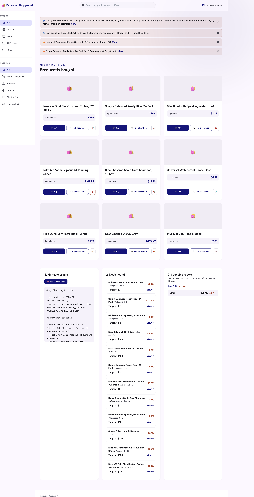

# 🛍️ Personal Shopper AI

[English](README.md) · [한국어](README_KO.md) · [中文](README_ZH.md) · [日本語](README_JA.md)

> A private AI shopper that remembers your purchase habits, compares public prices across stores, and helps you make better buying decisions.

<p align="center">
  <a href="https://github.com/meshcode-ai/Personal-shopper-ai"></a>
</p>

## The problem

> Most people only ever buy from the store they're already used to — never checking if it's cheaper elsewhere — so they end up overpaying by default. That was me too. Fixing that one habit alone cut my own spending by 15–50%.

Finding the best deal still means jumping between countless online stores and global marketplaces. Shoppers must remember their own repeat purchases, preferred brands, and price sensitivity while manually comparing tabs.

Department stores offer personal shoppers; individuals rarely get that experience online.

## The solution

Personal Shopper AI keeps a private, local record of purchases from the stores you use. It learns interests and repeat-buying patterns, compares public product and price data across stores, and recommends cheaper or better-fitting alternatives.

It can also translate global-store product names and search terms into terms you'll recognize, and surfaces a shopping-assistant banner with hot deals, restock reminders, and cross-border price estimates.

## How it works

If you just handed this repo's link to your AI agent and it's asking "what is this," here's the one-paragraph version: **it's an AI personal shopper that uses [MeshCode.ai](https://meshcode.ai) as a remote controller talking to your real Chrome browser** — it pulls your purchase history straight out of whatever malls you already shop at (not a scraping proxy, your own already-signed-in session), figures out from those malls roughly what country you're shopping in, and then checks the other major malls people there commonly use so your buying picture isn't limited to one store. It uses all of that purchase history to search the same or similar products across malls and nudge you toward the cheaper, more rational buy — not toward whatever the mall you're currently browsing wants to sell you.

```text
Your selected, already-signed-in Chrome browser
                  ↓ MeshCode.ai chrome_bridge (remote control, not scraping) imports purchase history
            Local SQLite memory, stays on your device
                  ↓                                    ↘
   Learns preferences + tags products        shop domain → inferred country
                  ↓                                    ↓
   Compares public prices across malls       suggests other malls people in
                                              that country commonly use
                  ↓                                    ↙
        Shopping assistant insights + personalized recommendations
```

`chrome_bridge` is a free [MeshCode.ai](https://meshcode.ai) tool.

No extension, credential export, or additional installation is required. Passwords are never stored in the app database. Browser automation imports purchase history only from stores selected by the user, and only public product/price data is fetched for comparison.

## What users get

- **Better-price nudges:** “This item is 15% cheaper at another store.”
- **Personalized discovery:** recommendations based on repeat purchases and interests.
- **Global shopping, explained simply:** foreign product names and search terms explained in a familiar context.
- **Shopping assistant insights:** six kinds of dismissible banner alerts — hot deals, projected monthly savings, restock reminders, target-price watchlist hits, cross-border arbitrage estimates, and price-timing advice. See the "Shopping assistant insights" section below. There's no in-app chat UI; registration and questions go through your AI coding agent driving chrome_bridge directly.

## Demo

The bright product grid prioritizes price and purchase count. The green banner is an automatic better-price nudge based on imported purchase history.



## 🤖 AI Agent setup guide

You don't need to write any code — just hand this repo's link to your own coding agent (Claude Code, MeshCode, etc.) and ask it to "set this up via chrome bridge." A capable agent can run the whole flow autonomously:

1. **Bootstrap the server** — clone this repo, `bun install`, `cp .env.example .env`, `bun run db:migrate`, `bun run dev`.
2. **Ask you two things** — which shopping sites you use, and whether you're already logged into this browser for them. After the first site is registered, the agent can call `GET /api/shops/suggestions` — it infers your country from the site's domain (currently KR/US/CN/JP) and returns other sites people in that country commonly use, so the agent can proactively ask "you use Coupang, so probably in Korea — do you also shop at 11st or Musinsa?" instead of only registering what you name outright. It never auto-registers a suggestion; only sites you confirm get added.
3. **Import your real purchase history** — using **MeshCode chrome_bridge** (its browser automation tool), the agent opens your already-logged-in Chrome session for each site, scrapes your order history, and POSTs it to this app's import endpoint. If a site hits a login wall, the agent shouldn't give up — chrome_bridge drives a visible browser, so it nudges you to log in there, hands you control (`handoff`), then takes it back (`takeover`) once you're signed in and continues scraping:
   ```bash
   curl -X POST localhost:8787/api/shops -H 'content-type: application/json' \
     -d '{"name": "Coupang", "base_url": "https://www.coupang.com", "order_history_url": "https://www.coupang.com/mypage/orders"}'
   curl -X POST localhost:8787/api/shops/{id}/purchases/import -d '{"orders": [...]}'
   ```
4. **Analyze and finish** — the agent calls the analyze endpoint so recommendations become personalized:
   ```bash
   curl -X POST localhost:8787/api/analyze
   ```

No passwords are exported and no credentials leave your machine — the agent only ever drives your already-authenticated browser session. Open `http://localhost:8787` for a working, personalized shopper.

## Shopping assistant insights

`GET /api/insights` powers the dismissible top banner. Every insight persists to a
DB table; dismissing one (`DELETE /api/insights/:id`) marks it permanently and it
never reappears on rescan, even after the underlying deal is refreshed.

| Kind | What it tells you | Trigger | External call |
| --- | --- | --- | --- |
| `hot_deal` | "X is N% cheaper at store Y" (plus per-unit price when parseable) | ≥15% savings found from purchase history | auto background scan (mock price provider by default) |
| `monthly_saving` | "You could save about ₩N/month" | Repeat-bought item (2+ purchases) × actual purchase frequency | auto background scan (mock price provider by default) |
| `restock_reminder` | "You're due to restock" | Time since last purchase ≥ 80% of average repeat interval | none (purchase history only) |
| `watchlist_hit` | "Your target price was hit" | Product has a `target_price` set (🎯 button) and a cheaper listing was found | auto background scan (mock price provider by default) |
| `overseas_arbitrage` | "Cross-border buying is N% cheaper even after fees" | Fashion/electronics/beauty item ≥ ₩30,000, ≥10% savings after estimated shipping + duty | mocked overseas quote |
| `price_timing` | "This is the lowest price seen recently" / "prices are high right now" | 3+ scanned price snapshots for the same product | none (uses stored history) |

> The three rows above are filled by an automatic background scan (`scan_deals`), not by the
> agent — it can't drive chrome_bridge across every mall on every page load. When you ask the
> agent directly to compare prices, it looks it up live via chrome_bridge instead. Product detail
> and tags work the same way: the agent reads the page via chrome_bridge and extracts structured
> `{name, category}` tags itself (its own LLM, no separate hosted API needed) — see the AI Agent
> setup guide above.

Also: `GET /api/spending/report` (rolling 30-day vs prior 30-day category spend, anchored
to the latest purchase date rather than the calendar) and `PATCH /api/products/:id/watch`
(`{ "target_price": 15000 }` to set, `{ "target_price": null }` to clear).

Scope notes: overseas duty is a rough estimate (Korea's duty-free de minimis, ~19%
blended duty+VAT above it) — actual rates vary by HS code, so the message always says
"estimate." Per-unit pricing only fires when a count like "24-pack" or "320 sticks" is
parseable from the title; it doesn't cross-shop different pack sizes. See `README_KO.md`
for the fuller writeup (Korean).

## Run locally

```bash
git clone https://github.com/meshcode-ai/Personal-shopper-ai.git
cd personal-shopper-ai
bun install
cp .env.example .env
bun run db:migrate
bun run dev
```

Open `http://localhost:8787`.

The app works with mock data when provider keys are absent. For real AI-personalized responses, set `LLM_API_KEY` (plus `LLM_BASE_URL`/`LLM_MODEL`) in `.env`; keep every provider key server-side.

## Verify

```bash
bun test
```


---
