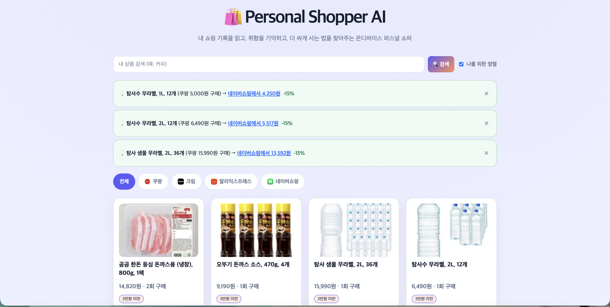

# 🛍️ Personal Shopper AI

[English](README.md) · [한국어](README_KO.md) · [中文](README_ZH.md) · [日本語](README_JA.md)

> 내 쇼핑 기록을 읽고, 내 취향을 기억하고, 더 싸게 사는 법을 찾아주는 **온디바이스 퍼스널 쇼퍼**

> **나만의 퍼스널 쇼핑 AI** — 내가 자주 가는 모든 쇼핑몰의 구매 이력을 기억하고, 다른 쇼핑몰의 더 싼 상품을 비교해 추천합니다. 해외 글로벌 쇼핑몰의 상품도 한국어 검색어로 풀어주며, 핫딜·재구매 시점·해외직구 실익까지 알려주는 쇼핑 어시스턴트 인사이트로 다음 쇼핑을 미리 준비해줍니다.

<p align="center">
  <a href="https://github.com/meshcode-ai/Personal-shopper-ai"></a>
</p>

---

## 문제 — 쇼핑은 아직 너무 많은 탭과 기억을 요구합니다

> 사람들은 대부분 자기가 익숙한 쇼핑몰에서만 계속 산다. 다른 데가 더 싼지 확인할 생각조차 안 하고, 결국 늘 비싸게 산다. 나도 그랬다 — 이 습관 하나만 고쳤을 뿐인데 지출이 최소 15%, 많게는 50%까지 줄었다.

온라인에서 더 싸게 사려면 쿠팡·네이버쇼핑·크림·해외몰을 하나씩 오가며 가격을 비교해야 합니다. 내가 무엇을 자주 사고, 어느 가격대에 민감한지, 재구매할 시점이 언제인지도 결국 사람이 기억해야 합니다.

백화점에는 내 취향을 알고 대신 찾아주는 퍼스널 쇼퍼가 있지만, 개인의 온라인 쇼핑에는 이런 서비스가 거의 없습니다. 여러 쇼핑몰에 흩어진 내 구매 이력과 공개 상품 정보를 한 화면에서 연결해 주는 쇼핑 도우미가 필요합니다.

## 해결 — 나만의 AI 퍼스널 쇼퍼

Personal Shopper AI는 내가 자주 가는 쇼핑몰의 구매 내역을 **내 로컬 DB**에 쌓고, 그 이력을 기반으로 취향·재구매 패턴·가격 민감도를 기억합니다. 이후 관심 상품을 여러 쇼핑몰의 공개 가격과 비교해 더 싸거나 더 적합한 대안을 제안하고, 해외몰 상품도 한국어 검색어와 맥락으로 풀어줍니다.

```text
사용자가 선택한 기존 로그인 Chrome 브라우저
                ↓ 브라우저 자동화로 구매 이력 가져오기
             로컬 SQLite 메모리 (내 기기에만 저장)
       취향 기억 · 상품 태그 추출
                ↓
       여러 쇼핑몰의 공개 상품·가격 비교
                ↓
      “다른 몰에서 15% 더 싸요” + 개인화 추천
```

확장 프로그램, 자격증명 내보내기, 추가 설치는 필요 없습니다. 비밀번호는 앱 DB에 넣지 않으며, 사용자가 선택한 쇼핑몰의 구매 이력만 브라우저 자동화로 가져옵니다. 로그인 정보가 아닌 공개 상품·가격 데이터만 비교에 사용합니다.

## 작동 방식 — 한 줄로 말하면

이 저장소 링크를 AI 에이전트에게 던져주면 "이게 뭐냐"고 물어볼 텐데, 한 줄로 이렇게 설명하면 된다: **[MeshCode.ai](https://meshcode.ai)가 내 실제 크롬 브라우저와 소통하는 리모트 컨트롤러 역할을 해서, 내가 쓰는 여러 쇼핑몰의 구매내역을 그대로 가져오고**, 그 몰들을 보고 "이 사람은 대략 이 나라에서 쇼핑하는구나"를 추정해서 **그 나라 사람들이 흔히 같이 쓰는 주요 쇼핑몰까지 넓혀서 상품을 검색**해준다. 그렇게 모은 내 구매내역을 근거로 여러 몰의 같은/비슷한 상품을 비교해 **더 싸고 합리적인 소비**로 넛지하는 AI 퍼스널 쇼퍼다 — 어느 한 몰이 팔고 싶은 걸 추천하는 게 아니라.

```
내 실제 크롬 (이미 로그인됨)
        ↓ MeshCode.ai chrome_bridge — 스크래핑 프록시가 아니라 "내 브라우저 리모트 컨트롤"
   구매내역 임포트 → 로컬 SQLite
        ↓                                     ↘
취향 기억 · 상품 태그                     등록된 몰 도메인 → 내 나라 추정
        ↓                                     ↓
여러 몰 공개 가격 비교                    그 나라에서 흔히 쓰는 다른 몰 후보 넛지
        ↓                                     ↙
        쇼핑 어시스턴트 인사이트 + 개인화 추천
```

`chrome_bridge`는 [MeshCode.ai](https://meshcode.ai)가 제공하는 무료 툴이다.

## 무엇을 해주나요?

- **더 싸게 쇼핑:** 내가 산 상품을 기준으로 다른 쇼핑몰의 공개 가격을 비교해 더 싼 딜을 알려줍니다.
- **글로벌 쇼핑을 한국어로:** 해외몰의 상품명·검색어를 한국어 맥락으로 정리해 관심 상품을 찾기 쉽게 만듭니다.
- **내 취향을 기억:** 여러 쇼핑몰의 구매 이력을 로컬에서 분석해 관심사, 재구매 패턴, 가격 민감도를 기억합니다.
- **쇼핑 어시스턴트 인사이트:** 핫딜 · 매달 절약액 · 재구매 시점 · 목표가 알림 · 해외직구 실익 · 가격 타이밍, 6종류의 알림을 상단 배너에 띄웁니다. 자세한 내용은 아래 "🧠 쇼핑 어시스턴트 인사이트" 섹션 참고. 별도 인앱 채팅 UI는 없으며, 등록·질문은 AI 코딩 에이전트에게 직접 chrome_bridge로 시키는 방식입니다.

## 화면

밝고 큰 글씨의 상품 카드에서 **가격**과 **구매 횟수**를 우선 보여줍니다. 상단의 초록 배너는 실제 쿠팡 구매내역을 기준으로 자동으로 찾은 "다른 몰이 더 싸요" 넛지이고, 그 아래 그리드는 실제 쿠팡/크림 계정에서 chrome_bridge로 가져온 진짜 상품 사진·가격·구매 횟수입니다.



## 🤖 AI 에이전트 실행 가이드 — 이 저장소 링크만 주면 됩니다

> 아래는 **사람이 아니라 AI 코딩 에이전트**(Claude Code 등)를 위한 플레이북이다.
> 사용자가 이 저장소 링크만 던져줘도, 에이전트가 이 섹션을 그대로 따라 실행하면
> DB 초기화부터 온보딩·데이터 수집·개인화 그리드까지 완성된 웹앱이 뜬다.
> (아래는 하단의 배경/아키텍처 설명과 별개로, 이것만 읽고도 끝까지 실행 가능하게 썼다.)

### 0. 서버 기동

```bash
git clone <이 저장소 URL>
cd personal-shopper-ai
bun install
cp .env.example .env    # 키가 없어도 전부 mock으로 동작한다 — 지금 안 채워도 된다
bun run db:migrate
bun run dev              # http://localhost:8787
```

### 1. 온보딩 — 사용자에게 딱 2가지만 물어라

1. **"어떤 쇼핑몰을 자주 쓰세요?"** (예: 쿠팡, 네이버쇼핑, 알리익스프레스, 크림 — 뭐든 좋다)
2. **"그 쇼핑몰에 지금 이 브라우저로 로그인되어 있나요?"** (로그인돼 있으면 비밀번호는 필요 없다)

답변마다 바로 등록한다 — 서버가 자동으로 `memory/shops.md`에 기록하므로 md를 직접 쓸 필요는 없다:

```bash
curl -X POST localhost:8787/api/shops -H 'content-type: application/json' -d '{
  "name": "쿠팡",
  "base_url": "https://www.coupang.com",
  "order_history_url": "https://www.coupang.com/mypage/orders"
}'
```

로그인이 안 돼 있고 사용자가 비밀번호를 알려주면(선택 사항, 되도록 권하지 마라):

```bash
curl -X POST localhost:8787/api/shops/{id}/credentials -d '{"username":"...", "password":"..."}'
```

→ 비밀번호는 OS 키체인에 저장되고 DB에는 참조 키만 남는다. 응답에도 절대 노출되지 않는다.

**첫 몰을 등록하고 나면, 바로 이어서 넛지 후보를 물어봐라** — 등록된 몰의 도메인으로 나라를
추정해서, 그 나라 사람들이 흔히 같이 쓰는 몰 후보를 내려준다:

```bash
curl localhost:8787/api/shops/suggestions
# → {"inferred_country":"KR","based_on":["쿠팡"],"suggestions":[{"name":"11번가", ...}, ...]}
```

이 목록은 절대 자동으로 등록하지 마라 — 실제 계정 보유 여부는 사용자만 안다. "쿠팡 쓰시는 거
보니 한국에서 쇼핑하실 텐데, 11번가·G마켓·무신사도 자주 쓰세요?"처럼 물어보고, 사용자가 "그
몰도 써요"라고 확인한 것만 위와 같은 방식으로 `add_shop` → chrome_bridge 로그인 확인 →
구매내역 수집까지 이어가라. 아직 지원 나라가 적으니(현재 KR/US/CN/JP), 목록에 없는 나라거나
후보가 부실하면 그냥 사용자에게 직접 물어보는 원래 방식으로 돌아가면 된다.

### 2. 구매내역 수집 — **chrome_bridge가 1순위**

사용자 계정의 실제 주문내역은 로그인 벽 안에 있어 공개 크롤러가 볼 수 없다.
**너(에이전트)의 chrome_bridge 툴로 사용자의 이미 로그인된 브라우저를 직접 열어** 주문내역
페이지를 읽고, 파싱한 결과를 아래로 반영해라 — 이게 "내 쇼핑 스타일 파악"의 근거 데이터가 된다:

```bash
curl -X POST localhost:8787/api/shops/{id}/purchases/import -d '{
  "orders": [
    {"item_name": "...", "price": 12345, "quantity": 1, "bought_at": "2026-08-01", "product_url": "https://..."}
  ]
}'
```

**로그인 벽에 걸리면(주문내역 페이지가 로그인/가입 화면으로 튕기면) 그냥 포기하지 말고 넛지해라** —
chrome_bridge는 실제로 눈에 보이는 크롬을 띄우니, "OO 몰은 로그인이 안 돼 있어서 창을 열어뒀어요,
로그인해주시면 바로 이어서 가져올게요"라고 말하고 `handoff`(사용자에게 조작권 넘기기)로 대기했다가,
사용자가 로그인을 마치면 `takeover`로 다시 제어권을 가져와 주문내역 페이지를 읽어라. Temu·타오바오처럼
비로그인으로는 검색/주문내역 자체가 안 뜨는 몰(`server/src/providers/malls.ts`의 `scrape_path:
"login_wall"`/`"app_only"` 참고)은 이 경로가 사실상 유일한 해법이다.

chrome_bridge를 못 쓰는 상황(브라우저 자동화 미연결 등)이거나 사용자가 로그인을 원하지 않으면
데모 데이터로 대체해 흐름을 끊지 마라 — 샵 이름이 **"쿠팡" · "네이버쇼핑" · "알리익스프레스" · "크림"**
과 정확히 같을 때만 동작한다:

```bash
curl -X POST localhost:8787/api/shops/{id}/sync
```

### 3. 상품 상세 + 태그 — **chrome_bridge가 기본**

공개 정보(상세페이지·가격)도 개인 데이터와 똑같이 다룬다 — 네가 chrome_bridge로 직접
상세페이지를 열어 읽고 아래로 제출해라. `{name, category}` 구조화 태그도 서버가 아니라
**네가(에이전트, 네 LLM으로) 직접 뽑아서** `tags`로 같이 채운다:

```bash
curl -X POST localhost:8787/api/products/{id}/detail -d '{
  "title": "...", "description": "...", "detail_content": "...", "image_url": "...",
  "tags": [{"name": "...", "category": "브랜드"}]
}'
```

> **데이터 타입 규칙**: `detail_content`엔 원본 HTML을 그대로 넣지 말고 평문 텍스트로 정리해서
> 넣어라. 가격은 정수, 태그는 항상 `{name, category}` 객체 배열이다 — 전부 그리드가 파싱 없이
> 바로 렌더링할 수 있는 형태여야 한다.

> `POST /api/products/{id}/enrich`도 있긴 하다 — 서버에 보조 데이터 소스가 설정돼 있을 때만
> 자동으로 채워보는 선택적 지름길인데, 기본값(키 없음)에서는 대부분 실패한다. 먼저 시도할
> 필요 없이 곧장 위 경로로 제출해도 된다.

### 4. 취향 분석 → 완성

```bash
curl -X POST localhost:8787/api/analyze   # PROFILE.md 갱신, 이후 검색이 개인화된다
```

이제 `http://localhost:8787`을 열면 검색바 · 쇼핑몰 탭 · 개인화 그리드가 뜬 완성된 앱이 보인다.

### 검증

```bash
bun test   # 스모크테스트가 전부 통과해야 한다 (현재 32개)
```

---

## 한 줄 요약

백화점에는 **컨시어지**가 있다. 온라인 쇼핑에는 없다.
Personal Shopper AI는 내가 실제로 쓰는 쇼핑몰(쿠팡 · 네이버쇼핑 · 알리익스프레스 · 크림 등, 어떤 몰이든 추가 가능)의 **내 구매내역을 직접 읽어와** 취향 메모리를 만들고, 그 메모리를 기준으로 **지금 사야 할 것 / 더 싼 곳 / 재구매 타이밍**을 알려주는 개인용 쇼핑 에이전트다.

---

## 왜 이게 필요한가

기존 쇼핑몰 추천은 **그 몰 안에서만**, **그 몰이 팔고 싶은 것**을 추천한다.

| 문제 | 지금 | Personal Shopper AI |
| --- | --- | --- |
| 내 취향을 아는 주체 | 쿠팡은 쿠팡 것만, 네이버는 네이버 것만 앎 | **모든 몰의 구매내역을 한 곳에 합쳐서** 나를 이해 |
| 추천의 목적 | 몰의 매출 최적화 | **내 지갑 최적화** (같은 물건 최저가) |
| 재구매 | 내가 기억해야 함 | 주기 학습해서 **먼저 알려줌** |
| 데이터 | 몰 서버에 있음 | **내 노트북 SQLite에만 있음** |

---

## 핵심 아이디어 — 로그인 장벽을 어떻게 넘는가

이 프로젝트의 기술적 핵심은 **"남의 데이터"가 아니라 "내 데이터"를 가져온다**는 점이다.

```
❌ 스크래핑 프록시로 쿠팡 로그인 뚫기   → 불가능하고, 해서도 안 됨
✅ 내가 이미 로그인해둔 내 크롬을 자동화 → 내 계정, 내 데이터, 내 기기
```

`chrome_bridge`(meshcode.ai 내부 브라우저 자동화)로 **사용자 본인의 이미 인증된 크롬 세션**을 그대로 조종해서 주문내역 페이지를 읽는다.
비밀번호를 서버로 보내지도, 세션을 탈취하지도 않는다. 브라우저는 처음부터 끝까지 사용자 기기에 있다.

**공개 데이터(가격/재고/경쟁 상품)도 같은 `chrome_bridge`가 담당한다.** 로그인이 필요하든
안 하든, 에이전트가 이미 열려 있는 실제 브라우저로 직접 확인한다 — 역할을 굳이 나누지 않는다.

| 데이터 종류 | 담당 |
| --- | --- |
| 내 주문내역 (로그인 필요) | `chrome_bridge` — 내 브라우저 세션 |
| 상품 가격 · 재고 · 경쟁 상품 (공개) | `chrome_bridge` — 에이전트가 직접 찾아봄 |

---

## 아키텍처

```
┌──────────────────────────────────────────────────────────────┐
│  Web UI  (바닐라 JS + Tailwind CDN, 빌드 스텝 없음)             │
│  검색 · 쇼핑몰/카테고리 탭 · 상품 그리드 · 인사이트 배너         │
└───────────────────────────┬──────────────────────────────────┘
                            │ HTTP (localhost only)
┌───────────────────────────▼──────────────────────────────────┐
│  Local Server  (Bun + Hono)         ← API 키는 여기서만 산다   │
│                                                              │
│   ┌────────────┐   ┌──────────────┐   ┌──────────────────┐   │
│   │ Shop Agent │   │ Sync Engine  │   │ Recommender      │   │
│   │ (CRUD 툴)  │   │ chrome_bridge│   │ (에이전트 LLM)    │   │
│   └─────┬──────┘   └──────┬───────┘   └────────┬─────────┘   │
│         └─────────────────┴────────────────────┘             │
│                           │                                  │
│                  ┌────────▼─────────┐                        │
│                  │  bun:sqlite      │  ← 내 기기에만 존재     │
│                  │  shops/purchases │                        │
│                  │  interests/deals │                        │
│                  └──────────────────┘                        │
└──────────────────────────────────────────────────────────────┘
        │
   ┌────▼────┐
   │ Chrome  │  구매내역 · 상품 상세 · 가격 비교, 전부 여기서
   │ (내 세션)│  chrome_bridge로 직접 읽어온다
   └────┬────┘
        │
 ┌──────▼──────┐
 │  Daytona    │  파서 코드를 샌드박스에서
 │  샌드박스    │  안전하게 실행/자가수정
 └─────────────┘
```

---

## 온보딩 플로우

```
1. 앱 첫 실행
      ↓
2. "자주 가는 쇼핑몰이 어디세요?"  ← 자연어로 말해도 됨
      ↓
3. 에이전트가 add_shop 툴 호출 → shops 테이블에 등록
      ↓
4. (선택) 로그인 정보 입력 → set_shop_credential → 비밀번호는 OS 키체인으로
      ↓
5. chrome_bridge로 해당 몰 열어서 로그인 상태 확인 → 주문내역 싱크 → purchases
      ↓
6. 구매내역이 들어올 때마다 products 카탈로그가 자동 집계됨 (재구매 횟수 포함)
      ↓
7. submit_product_detail → chrome_bridge로 상세페이지 확인 + 에이전트가 직접
   구조화 태그({name, category}) 추출해서 같이 제출
      ↓
8. analyze_interests → 구매 패턴에서 취향 프로필(PROFILE.md) 갱신
      ↓
9. search_products(personalized=true) → 태그×취향이 겹치는 상품이 먼저 뜨는 그리드
      ↓
10. chrome_bridge로 다른 몰 가격 직접 비교 → 딜 피드 완성
```

---

## 데이터 모델

구매내역(`purchases`, 이력)과 상품 카탈로그(`products`, "이 URL의 상품" 단일 레코드)를 분리했다.
같은 상품을 여러 번 사면 `purchases`엔 행이 쌓이고, `products.purchase_count`가 올라간다.

```sql
CREATE TABLE shops (
  id                  INTEGER PRIMARY KEY,
  name                TEXT NOT NULL UNIQUE,
  base_url            TEXT NOT NULL,
  order_history_url   TEXT,
  credential_username TEXT,             -- 로그인 아이디. 비밀 아님.
  credential_ref      TEXT,             -- ⚠️ OS 키체인 참조 키 (평문 비번 아님)
  parser_version      INTEGER DEFAULT 1,
  last_synced_at      TEXT,
  created_at          TEXT DEFAULT (datetime('now'))
);

-- "내가 자주 사는 상품"의 단일 소스. (shop_id, product_url) 기준으로 수렴.
CREATE TABLE products (
  id              INTEGER PRIMARY KEY,
  shop_id         INTEGER NOT NULL REFERENCES shops(id) ON DELETE CASCADE,
  product_url     TEXT NOT NULL,
  title           TEXT,
  description     TEXT,
  detail_content  TEXT,                 -- 상세페이지 크롤링 본문 (구조화 전 원문)
  image_url       TEXT,
  last_price      INTEGER,
  purchase_count  INTEGER DEFAULT 0,
  last_crawled_at TEXT,
  created_at      TEXT DEFAULT (datetime('now')),
  UNIQUE(shop_id, product_url)
);

-- 태그는 항상 {name, category} 구조. category ∈ {브랜드, 카테고리, 속성, 가격대}
CREATE TABLE tags (
  id       INTEGER PRIMARY KEY,
  name     TEXT NOT NULL UNIQUE,
  category TEXT
);

CREATE TABLE product_tags (
  product_id INTEGER NOT NULL REFERENCES products(id) ON DELETE CASCADE,
  tag_id     INTEGER NOT NULL REFERENCES tags(id) ON DELETE CASCADE,
  PRIMARY KEY (product_id, tag_id)
);

CREATE TABLE purchases (
  id          INTEGER PRIMARY KEY,
  shop_id     INTEGER NOT NULL REFERENCES shops(id) ON DELETE CASCADE,
  product_id  INTEGER REFERENCES products(id) ON DELETE SET NULL,
  item_name   TEXT NOT NULL,
  price       INTEGER,
  quantity    INTEGER DEFAULT 1,
  bought_at   TEXT,
  product_url TEXT,
  raw_json    TEXT,                     -- 원본 보존, 파서 개선 시 재파싱
  UNIQUE(shop_id, product_url, bought_at)
);

CREATE TABLE interests (
  id         INTEGER PRIMARY KEY,
  tag        TEXT NOT NULL UNIQUE,      -- 지금은 구매한 상품명 자체가 태그가 된다
  score      REAL DEFAULT 0,            -- 구매 빈도
  evidence   TEXT,
  updated_at TEXT DEFAULT (datetime('now'))
);

CREATE TABLE deals (
  id            INTEGER PRIMARY KEY,
  purchase_id   INTEGER REFERENCES purchases(id),
  found_shop    TEXT,
  found_price   INTEGER,
  found_url     TEXT,
  savings_pct   REAL,
  found_at      TEXT DEFAULT (datetime('now'))
);
```

### 🔐 자격증명은 DB에 넣지 않는다

`shops.credential_ref`에는 **참조 키만** 들어간다. 실제 비밀번호는 OS 키체인에 있다.
`server/src/providers/keychain.ts`가 이걸 래핑한다 — macOS면 `security` CLI를,
`MOCK_KEYCHAIN=1`이거나 macOS가 아니면 로컬 파일 기반 스텁(개발/테스트 전용)을 쓴다.

```bash
# 저장 (앱이 대신 해준다 — POST /api/shops/:id/credentials)
security add-generic-password -a "personal-shopper:shop:1" -s "personal-shopper-ai" -w

# 조회 — API 응답에는 절대 노출되지 않는다. hasCredential 불리언만 나간다.
security find-generic-password -a "personal-shopper:shop:1" -s "personal-shopper-ai" -w
```

로컬 전용 개인 앱이라도 SQLite 컬럼에 평문 비밀번호를 두지 않는다.
가능하면 **비밀번호 저장 자체를 생략**하고, 사용자가 이미 브라우저에 로그인해둔 세션만 사용하는 게 최선이다.

### 🏷️ 태그는 항상 구조화된다

chrome_bridge로 상세페이지를 읽은 직후 **에이전트가 직접(자기 LLM으로)** 태그를 뽑아
제출하는 게 기본이다. 자유 텍스트가 아니라 **`{name, category}` 쌍**으로 고정한다.
(태그 없이 제출하면 서버가 mock 키워드 매칭으로 대충 채우긴 하는데, 정확도가 낮아서
권장하지 않는다.) `category`는 4종(`브랜드` · `카테고리` · `속성` · `가격대`)뿐이라
검색 UI에서 색상 구분이 가능하고, 개인화 점수 계산(`personalizationBonus`)에서
"이 태그가 내 취향(interests)과 겹치는가"를 일관되게 판단할 수 있다.

---

## 검색 & 개인화

`GET /api/products?query=&shop_id=&personalized=` 하나가 그리드 · 탭 필터 · 검색을 겸한다.

- **텍스트 매칭**: 제목/설명/태그 이름에 LIKE — 제목 일치가 가장 높은 점수.
- **개인화 보너스**(`personalized=1`, 기본값): 상품 태그가 `interests` 테이블의 항목과
  겹치면 그 interest의 점수만큼 더한다. 즉 **내가 자주/최근 산 것과 관련된 상품이
  검색어 없이도 위로 뜬다.** `personalized=0`으로 끄면 순수 텍스트/최신순.

---

## 🧠 쇼핑 어시스턴트 인사이트

상단 배너(`GET /api/insights`)에 뜨는 6종류의 알림이다. 전부 `insights` 테이블에
영속화되고, 사용자가 배너에서 닫으면(`DELETE /api/insights/:id`) `dismissed_at`이
찍혀서 그 뒤로 재스캔해도 다시 뜨지 않는다 — 클라이언트 메모리가 아니라 DB에
남기는 "이해하고 지우면 끝"인 구조다.

| 종류 (`kind`) | 무엇을 알려주나 | 발동 조건 | 외부 호출 |
| --- | --- | --- | --- |
| `hot_deal` | "OO을 XX몰에서 사면 N% 더 싸요 (개당 가격 포함)" | 구매내역 기반 딜 스캔에서 15%↑ 절약 | 자동 스캔 (mock 가격 provider, 기본값) |
| `monthly_saving` | "매달 약 N원 아낄 수 있어요" | 2번 이상 재구매한 상품 × 실제 구매 빈도로 월 절약액 환산 | 자동 스캔 (mock 가격 provider, 기본값) |
| `restock_reminder` | "슬슬 다시 살 때예요 / 다 떨어졌을 시점이에요" | 평균 재구매 간격의 80%↑ 경과 (순수 구매 이력만 사용) | 없음 |
| `watchlist_hit` | "목표가 이하로 딜이 잡혔어요" | 상품카드 🎯 버튼으로 등록한 목표가 이하 발견 | 자동 스캔 (mock 가격 provider, 기본값) |
| `overseas_arbitrage` | "해외직구하면 배송비/관·부가세 포함해도 N% 싸요" | 패션·전자기기·뷰티 카테고리 + 3만원 이상 + 10%↑ 이득(추정) | mock 해외 가격 |
| `price_timing` | "지금이 최근 중 최저가 / 요즘 비싸니 기다려 보세요" | 같은 상품을 여러 번 스캔해 쌓인 가격 이력(`price_snapshots`) 비교 | 없음 (이미 쌓인 이력만) |

> `hot_deal`/`monthly_saving`/`watchlist_hit`는 페이지 로드마다 도는 **자동 배경 스캔**
> (`scan_deals`)이 채운다 — 몰마다 에이전트를 chrome_bridge로 돌릴 순 없으니 여기만 예외적으로
> 서버가 자체 가격 provider(기본은 mock, 원하면 실제 API 키로 교체 가능)를 쓴다. 반면 사용자가
> 대화 중 직접 "이거 다른데서 더 싸?"라고 물으면 에이전트가 chrome_bridge로 직접 찾아서 답한다 —
> [핵심 아이디어](#핵심-아이디어--로그인-장벽을-어떻게-넘는가) 참고.

### API

```bash
GET    /api/insights            # 안 닫은 인사이트 목록
POST   /api/insights/scan       # 6종류 다시 스캔 (페이지 로드 시 자동 호출)
DELETE /api/insights/:id        # 닫기 — DB에 영구 반영, 재스캔해도 안 돌아옴

GET    /api/spending/report     # 최근 30일 vs 그 이전 30일 카테고리별 지출
PATCH  /api/products/:id/watch  # { "target_price": 15000 } 등록, { "target_price": null } 해제
```

### 스코프 고지 — 정확도보다 "따져볼 가치가 있는지"를 보여주는 게 목적인 것들

- **해외직구 실익**은 관세청 목록통관 면세 한도(미화 150달러)만 단순 반영한 추정치다. 실제
  관/부가세는 품목별 세율(HS 코드)마다 다르므로, 문구에 항상 "추정치"를 명시한다
  (`server/src/providers/overseas.ts`).
- **가격 타이밍**은 스캔이 실제로 일어난 시점에만 `price_snapshots`에 한 줄씩 쌓인다 — 정기
  크론이 아니라, 자주 볼수록 더 정확해지는 구조다. mock 가격에는 ±6% 지터를 줘서
  (`server/src/providers/brightdata.ts`) 매번 완전히 똑같은 값만 나오지 않게 했다.
- **개당(단위) 가격**은 상품명에서 "24개입"/"320T" 같은 수량 패턴이 파싱될 때만 붙는다.
  같은 상품의 다른 용량/개수 변형을 찾아와 교차비교하는 기능은 아니다 — mock 가격
  제공자가 그 변형들을 따로 찾아오는 능력이 없어서 스코프를 좁혔다 (`server/src/core/unitPrice.ts`).
- **지출 리포트**는 달력 월이 아니라 "가장 최근 구매일" 기준 최근 30일 vs 그 이전 30일을
  비교한다 — 오늘 날짜로 끊으면 동기화를 며칠 거른 계정은 항상 0원만 보이기 때문이다
  (`server/src/core/spending.ts`).

---

## 에이전트 툴 스펙

에이전트는 시스템 인스트럭션(`server/src/agent/system-prompt.ts`)으로 아래 툴들을 이해하고
샵/상품 테이블을 동적으로 관리한다. 스키마는 `server/src/agent/tools.ts`에 OpenAI/Qwen
호환 tool-calling 형식으로 정의돼 있다.

| 툴 | 설명 |
| --- | --- |
| `add_shop(name, base_url, order_history_url?)` | 새 쇼핑몰 등록. 사용자가 대화 중 언급만 해도 자동 호출 |
| `list_shops()` | 등록된 몰 목록 |
| `update_shop(id, fields)` | 주소 변경, 주문내역 URL 보정 |
| `remove_shop(id)` | 등록 해제 (구매내역·상품도 cascade 삭제) |
| `set_shop_credential(shop_id, username, password)` | 로그인 정보 저장 — 비밀번호는 키체인으로 |
| `remove_shop_credential(shop_id)` | 저장된 로그인 정보 삭제 |
| `sync_purchase_history(shop_id)` | **데모 시드**만 채운다 (샵 이름이 4개 데모몰과 일치할 때) |
| `import_purchases(shop_id, orders)` | **실데이터 경로.** chrome_bridge로 스크랩한 주문내역을 그대로 반영 |
| `enrich_product(product_id)` | 상품 상세 자동 채우기 — 보조 데이터 소스가 설정돼 있을 때만 동작하는 선택 경로, 기본은 NO_DETAIL_SOURCE |
| `submit_product_detail(product_id, detail, tags?)` | **기본 경로.** chrome_bridge로 직접 읽은 상세 + 에이전트가 직접 뽑은 태그를 제출 |
| `analyze_interests()` | 구매 패턴 → interests 갱신 (에이전트/LLM 요약, 키 없으면 mock) |
| `search_products(query?, shop_id?, personalized?)` | 카탈로그 검색 (기본 개인화 정렬) |
| `find_better_price(purchase_id)` | 넛지 배너용 자동 가격 스캔(mock 기본) → deals 기록. 대화 중 직접 가격 비교는 chrome_bridge로 |
| `repair_parser(shop_id)` | 파서 실패 시 Daytona 샌드박스에서 새 파서 생성·검증 (설계 단계) |

> `sync_purchase_history` / `import_purchases`, `enrich_product` / `submit_product_detail`은
> 각각 "보조 지름길 실패 시 기본 경로" 쌍이다 — 기본은 항상 chrome_bridge다. 자세한 내용은
> [데이터 소스 우선순위](docs/ARCHITECTURE.md#데이터-소스-우선순위-요약) 참고.

---

## 기술 스택

| 레이어 | 선택 | 이유 |
| --- | --- | --- |
| 런타임 | **Bun** | TS 그대로 실행, 빌드 스텝 없음, 빠른 반복 속도 |
| 서버 | **Hono** | 초경량, 라우팅만 필요 |
| DB | **bun:sqlite** | 런타임 내장 → 네이티브 모듈 컴파일 리스크 0 |
| 프론트 | **빌드 없는 바닐라 JS** (`web/`) | Hono가 정적 파일로 직접 서빙, 번들러 세팅 시간 0 |
| 브라우저 자동화 | **chrome_bridge** | 사용자 실제 세션 재사용 |

> 프론트는 지금 바닐라 JS 한 파일이다. 팀이 Vite + React/Svelte에 익숙하면 `web/`만 갈아끼우면 되고, API 계약(`/api/*`)은 그대로 유지된다.

> **Tauri를 안 쓴 이유**: Tauri는 OS 네이티브 웹뷰(macOS = WKWebView)를 쓰기 때문에 번들은 가볍지만, Safari 엔진 호환성 이슈에 시간을 태울 위험이 있다. 로컬 서버 + 브라우저 조합으로도 "내 기기에만 데이터가 있다"는 서사는 그대로 유지된다.

---

## 시작하기

```bash
bun install

cp .env.example .env    # 전부 선택 사항 — 아래 참고

bun run db:migrate      # SQLite 스키마 생성
bun run dev             # http://localhost:8787  (API + 웹 UI 같은 포트)

bun test                # 스모크테스트 32개
```

키 없이도 전부 동작한다. 상품 상세/태그/가격비교는 기본적으로 chrome_bridge(+ 에이전트의
LLM)를 쓰므로 애초에 키가 필요 없다. `.env.example`에 있는 `DASHSCOPE_API_KEY` /
`BRIGHTDATA_API_TOKEN`은 넛지 배너 자동 스캔이나 취향 프로필 요약을 조금 더 정교하게
만들고 싶을 때만 선택적으로 채우는 값이고, 없으면 결정적 mock 응답(`MOCK_LLM` /
`MOCK_BRIGHTDATA`)으로 자동 대체된다. macOS가 아니거나 `MOCK_KEYCHAIN=1`이면 자격증명도
파일 기반 mock 키체인으로 폴백해서 데모/테스트 배관이 끊기지 않는다.

---

## 프로젝트 구조

```
personal-shopper-ai/
├── server/src/
│   ├── db/           schema.sql · client.ts (bun:sqlite 싱글턴) · migrate.ts
│   ├── core/          shops · purchases · products · interests · deals · credentials ·
│   │                   insights(6종 쇼핑 인사이트) · spending(지출 리포트) ·
│   │                   priceSnapshots · categories · unitPrice ·
│   │                   demo-data.ts(데모 시드 로더) — 순수 비즈니스 로직, 라우트와
│   │                   agent/tools.ts가 공유
│   ├── memory/        store.ts — md 미러(shops.md, PROFILE.md) 재생성
│   ├── agent/         tools.ts (tool-calling 스키마) · system-prompt.ts
│   ├── providers/     qwen.ts · brightdata.ts(SERP + 상세 Unlocker, mock 지터 포함) ·
│   │                   overseas.ts(해외직구 관/부가세 추정) · keychain.ts
│   │                   (전부 mock 폴백 내장)
│   ├── routes/        shops(+credentials,+purchases/import) · purchases · products(+detail,+watch) ·
│   │                   analyze · deals · insights · spending · memory
│   ├── fixtures/       demo-shops.json — 쿠팡·네이버쇼핑·알리익스프레스·크림 4개몰
│   │                   구매내역+상세페이지 데모 시드
│   └── index.ts        app 조립 + 정적 웹 서빙
├── web/                빌드 없는 바닐라 JS — 검색바 · 쇼핑몰 탭(+빠른추가) · 상품 그리드 · 온보딩
├── tests/smoke.test.ts  32개 시나리오
└── docs/ARCHITECTURE.md
```

---

## ⚖️ 사용 범위에 대해

- 이 도구는 **사용자 본인의 계정에서, 본인의 데이터를, 본인의 기기로** 가져오는 개인용 자동화를 전제로 한다.
- 쇼핑몰 이용약관은 일반적으로 자동화 접근을 제한한다. 개인 용도를 넘어 **배포·공유·상업화**할 경우 각 플랫폼의 약관 검토가 선행되어야 한다.
- 수집한 데이터는 로컬 SQLite 파일을 벗어나지 않는다. 외부로 나가는 것은 **가격 조회용 상품명**과 **취향 분석용 익명화된 요약**뿐이다.

---
